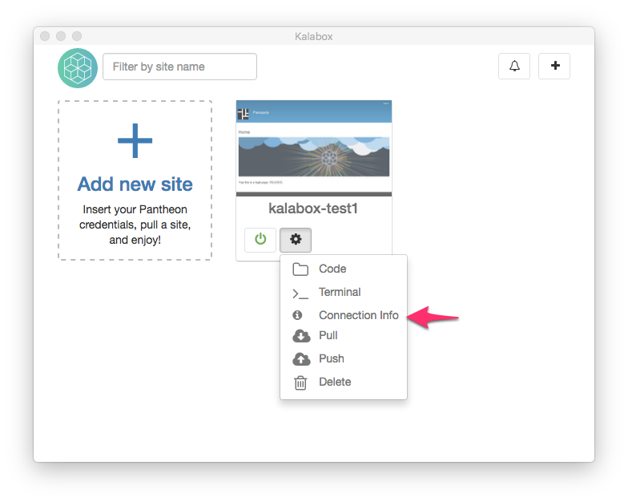

Kalabox GUI for Pantheon Apps
=====================

The Kalabox GUI allows you to pull down Pantheon sites, work on them, and push
changes back to them, all with a few clicks.

The following tutorial walks through creating a Pantheon app:

## 1. Click Add New Site

## 2. Add Your Pantheon Account

Insert your username and password. Note that in the near future, we will be
using Pantheon's Machine Tokens to authenticate. If you don't have a Pantheon
account, [sign-up for a free one](http://support.kalabox.io/support/solutions/articles/pantheon.io/register).

## 3. Click on Your Pantheon Account to See Available Sites

An accordion of site options should appear for you to select from. Click on one 
of the sites.

## 4. Name and Pull the Site

The name that you provide for the site will become the site's Kalabox URL:
"[name-of-site].kbox". It must be alpha-numeric; the only allowed special
character is a dash.

  
Non-Latin Characters

  
Right now Kalabox does not support characters beyond the 26 common Latin
    ones. This would be a great pull request (hint hint)!

You'll also chose which environment you want to pull from. This will dictate
where database/files come from, so be aware that large assets will slow site
creation.

## 5. Wait for Your Site to Download

When you first pull a Pantheon site, creation will take longer. This is because
Kalabox is downloading many extra assets (Docker images) needed to run your
site on Kalabox.

## 6. Success!

The green power light (and color screenshot) means your app is running. Click 
on the screenshot or site title to visit your site in the browser.

## 7. Getting Database Connection Info

If you click the "Actions" gear symbol on your new Pantheon app, you'll see
a number of options. Select "Connection Info" to see the database credentials
to connect to your apps database from a browser like
[PHPMyAdmin](https://www.phpmyadmin.net) or [SQLPro](http://www.sequelpro.com/).

## 8. Refreshing Your Site's Code, Database, and Files from Pantheon

Clicking "Pull Site" from the Actions dropdown allows you to pull down the
latest code, database, and files from your Pantheon site. Note that you must
select the environment you want to pull from, but you can also opt-out of
pulling your files or database. Pulling new code is mandatory.

  
Merge conflicts

  
If there's a merge conflict between the local code you have and the
    code that's on Pantheon, this operation won't succeed.

## 8. Pushing Your Work Back to Pantheon

When you're ready to deploy work back to Pantheon, select the "Push Site" option
from the Actions dropdown.

Even if you don't have code changes, you must fill out a commit message. 
This will leave you a commit message to record what database or file
changes you have deployed.

If your site is in "SFTP" mode on Pantheon and a commit already exists, you
will receive a warning that the push operation was not able to be completed.
You'll need to commit that code on Pantheon before the push operation can
be ran successfully.

