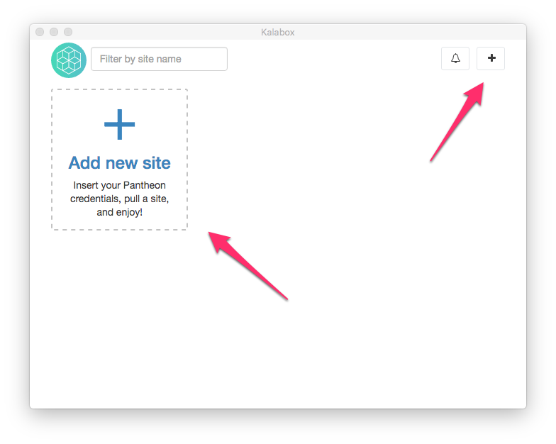
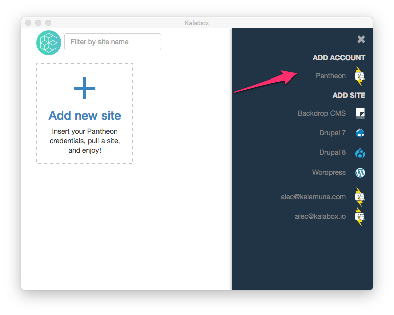
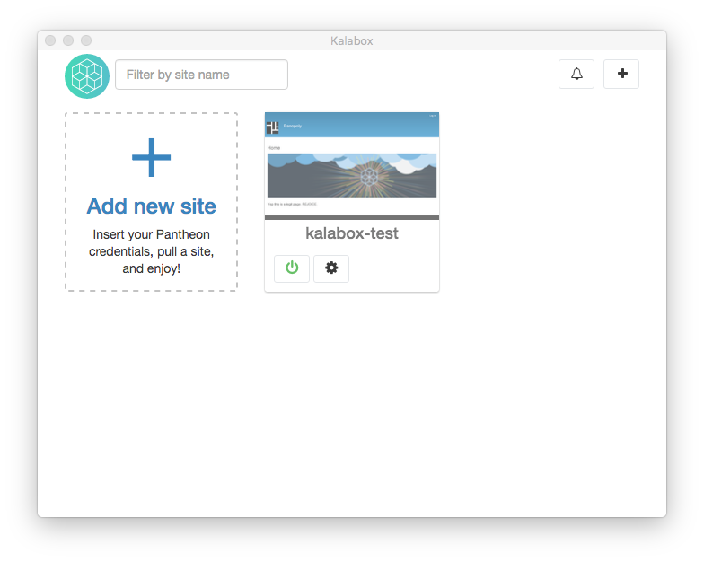

Kalabox GUI for Pantheon Apps
=============================

The Kalabox GUI allows you to pull down Pantheon sites, work on them, and push changes back to them, all with a few clicks.

If you are not already familiar with the basic Kalabox GUI please take some time to [read about it](http://docs.kalabox.io/en/stable/users/gui).

Access the Sidebar
------------------

The sidebar is where you can create Pantheon sites. To access the sidebar, either click "Add New Site" or the "+" button in the upper right-hand corner.

Connect a Pantheon Account
--------------------------

Click on "Pantheon" under "Add Account". Insert your username and password. Note that in the near future, we will be using Pantheon's Machine Tokens to authenticate. If you don't have a Pantheon account, [sign-up for a free one](http://support.kalabox.io/support/solutions/articles/pantheon.io/register).

Download a Site From Pantheon
-----------------------------

First, click on your newly added Pantheon account:

An accordion of site options should appear for you to select from. Click on one of the sites.

### Name and Pull the Site

A prompt should appear asking you to name your site, select the environment you'd like to pull from, and choose whether you want to pull down your site's database and files:

The name that you provide for the site will become the site's Kalabox URL:
"[name-of-site].kbox". It must be alpha-numeric; the only allowed special
character is a dash.

!!! caution "Non-Latin Characters"
    Right now Kalabox does not support characters beyond the 26 common Latin ones. This would be a great pull request (hint hint)!

You'll also chose which environment you want to pull from. This will dictate
where database/files come from, so be aware that large assets will slow site
creation.

!!! note "Why is My Site Taking So Long to Download?"
    When you first pull a Pantheon site, creation will take longer. This is because Kalabox is downloading many extra assets (Docker images) needed to run your site on Kalabox.

Your app should show up on the dashboard immediately, although it will be greyed out and will only show status messages regarding the creation progress:

When it has finished downloading, the green power light should be on and a color screenshot should be present:

Click on the screenshot or site title to visit your site in the browser.

Get Database Connection Info
----------------------------

If you click the "Actions" gear symbol on your new Pantheon app, you'll see a number of options. Select "Connection Info" to see the database credentials to connect to your apps database from a browser like [PHPMyAdmin](https://www.phpmyadmin.net) or [SQLPro](http://www.sequelpro.com/):

Pull Code, Database, and Files from Pantheon
--------------------------------------------

Clicking "Pull Site" from the Actions dropdown allows you to pull down the latest code, database, and files from your Pantheon site. Note that you must select the environment you want to pull from, but you can also opt-out of pulling your files or database. Pulling new code is mandatory.

!!! warning "Merge Conflicts"
    If there's a merge conflict between the local code you have and the code that's on Pantheon, this operation won't succeed.

Push Work Back to Pantheon
--------------------------

When you're ready to deploy work back to Pantheon, select the "Push Site" option from the Actions dropdown.

Even if you don't have code changes, you must fill out a commit message. This will leave you a commit message to record what database or file changes you have deployed.

If your site is in "SFTP" mode on Pantheon and a commit already exists, you will receive a warning that the push operation was not able to be completed. You'll need to commit that code on Pantheon before the push operation can be ran successfully.
